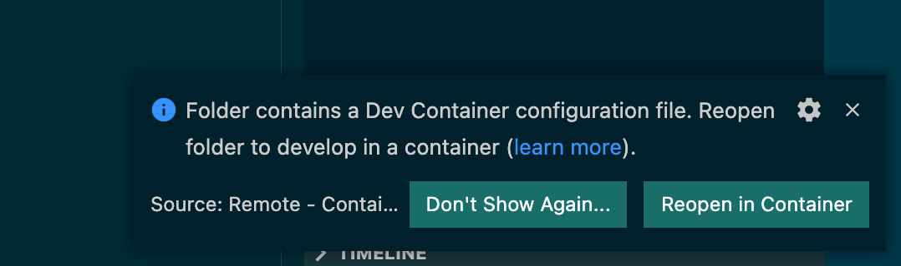
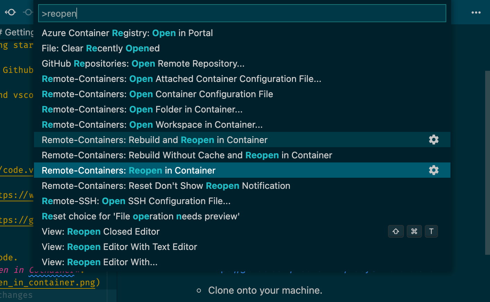

# Ruby on Rails Hartl Tutorial
* Tutorial Location: https://drive.google.com/drive/folders/1OLWh2fdWEBFQBn_Cz013HiyeKg9bGgFP?usp=sharing

*CAN IGNORE THE SECTION ON USING AWS' CLOUD IDE*
*PAGE 18 IS WHERE THE GOOD STUFF STARTS*

* This is a preconfigured environment to make getting started with Hartl easier.
* Uses a preconfigured dev container from Github (see `.devcontainer`)
* Works with Visual Studio Code, Docker and vscode dev containers.

  ## Getting started
  * Works best with Visual Studio Code
    * Install Visual Studio Code. https://code.visualstudio.com
  * Install Docker Desktop for Mac OS. https://www.docker.com/products/docker-desktop 
  * Fork the Ruby On Rails Tutorial. - https://github.com/DocFox-Inc/RubyOnRailsTutorial
  * Clone onto your machine.
  * Open the project with Visual Studio Code.
  * Run the dev container. Click on *Reopen in Cotnainer*.
    * 
  * Can also open the dev container in by pressing `command + shift + p` and selecting *Reopen in Container*.
    * 
  * Wait for container to build.
  * Terminal prompt will show when ready.
  * Check rails version `rails -v`
  ## Creating your first rails app
  * Create a new rails app. `rails new hello_app`
  * *CD* into *hello_app*
  * Run *rails server*
  * Will be able to see the page at http://localhost:3000/ - Ports are automatically forwarded to local environment.

*Ready for Ruby on Rails Tutorial.*

## Configuration
* Rails 6
* Postgres
* Nodejs/yarn
* Heroku CLI
* Git
* Developer gems for Ruby installed
  * RuboCop
  * Solargraph
  * Ruby-debug-ide
* Visual Studio Code Extensions
  * Name: Auto Add Brackets in String Interpolation
  * Name: Code Spell Checker
  * Name: docs-yaml
  * Name: EditorConfig for VS Code
  * Name: ESLint
  * Name: GitHub Pull Requests and Issues
  * Name: gitignore
  * Name: GitLens — Git supercharged
  * Name: Path Intellisense
  * Name: PostgreSQL
  * Name: Prettier - Code formatter
  * Name: Rails DB Schema
  * Name: Rails Routes
  * Name: Ruby
  * Name: Solargraph
  * Name: Ruby Syntax Replacer
  * Name: ruby-linter
  * Name: ruby-rubocop
  * Name: ruby-symbols
  * Name: SQLTools
  * Name: SQLTools PostgreSQL/Redshift Driver
  * Name: Text Power Tools
  * Name: Visual Studio IntelliCode
  * Name: YAML
  * Name: DotENV
  * Name: endwise
  * Name: GitHub Repositories
  * Name: Material Product Icons
  * Name: Peacock
  * Name: Rails Syntax Highlighting
  * Name: VSCode Ruby
  * Name: vscode-icons  

